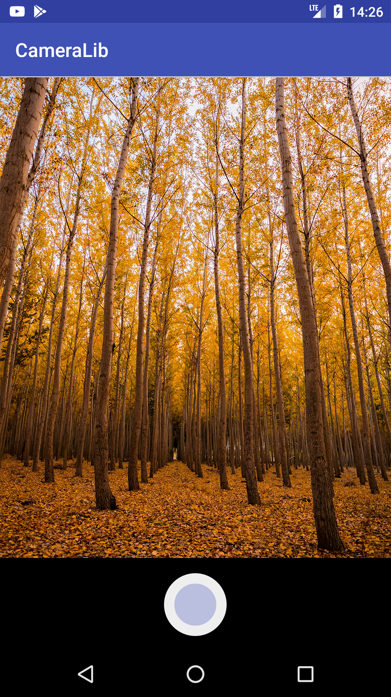

# CameraLib
Make a customized camera preview in seconds to take still images in your Android app 

 



## Demo Activity

```java

    Uri imageUri;
    /**
     * Request code for old versions with Camera 1 API " <  Build.VERSION_CODES.LOLLIPOP"
     * **/
    public static int OLD_CAMERA_INTENT_REQUEST=0x01d;

    /**
     * Request code for new versions with Camera 2 API "Build.VERSION_CODES.LOLLIPOP"
     * **/

    public static int COSTUME_CAMERA_INTENT_REQUEST=0xc0;

    ImageView result;
    Button request;
    @Override
    protected void onCreate(Bundle savedInstanceState) {
        super.onCreate(savedInstanceState);
        setContentView(R.layout.activity_main);
        result=(ImageView)findViewById(R.id.result);
        request=(Button)findViewById(R.id.request);

        /*Handle request button click action*/
        request.setOnClickListener(new View.OnClickListener() {
            @Override
            public void onClick(View view) {

                if(Build.VERSION_CODES.LOLLIPOP <= Build.VERSION.SDK_INT ){

                    /** Use our costume view for newer Android version that support Camera 2 API
                     *  Permissions are requested automatically from the CameraLib class **/

                    Intent preview=new Intent(getApplicationContext(),CameraPreviewActivity.class);
                    startActivityForResult(preview,COSTUME_CAMERA_INTENT_REQUEST);
                }else{

                    /** Use the old camera intent technique for devices that don't support Camera 2 API
                     *  These devices also require no permission request
                     *  However permission needs to be stated in the Manifest
                     *  android.permission.READ_EXTERNAL_STORAGE is required to get access to the external content uri **/

                    ContentValues values = new ContentValues();
                    values.put(MediaStore.Images.Media.TITLE, "New Picture");
                    values.put(MediaStore.Images.Media.DESCRIPTION, "From your Camera");
                    imageUri = getContentResolver().insert(MediaStore.Images.Media.EXTERNAL_CONTENT_URI, values);
                    Intent cameraIntent = new Intent(MediaStore.ACTION_IMAGE_CAPTURE);
                    cameraIntent.putExtra(MediaStore.EXTRA_OUTPUT, imageUri);
                    startActivityForResult(cameraIntent, OLD_CAMERA_INTENT_REQUEST);
                }
            }
        });

    }

    @Override
    protected void onActivityResult(int requestCode, int resultCode, Intent data)
    {
        if (requestCode == OLD_CAMERA_INTENT_REQUEST && resultCode == RESULT_OK){

            /** --> The default camera intent
             * The request result is in the image uri that we passed with the initiating intent **/

            try {
                Bitmap resultBitmap = MediaStore.Images.Media.getBitmap(getContentResolver(), imageUri);
                result.setImageBitmap(resultBitmap);
            } catch (IOException e) {
                e.printStackTrace();
            }
        }else if (requestCode == COSTUME_CAMERA_INTENT_REQUEST && resultCode == RESULT_OK){

            /** --> The costume preview camera intent
             * The request result is in the result holder in the form of a byte array **/

            final byte[] jpeg = ResultHolder.getImage();
            Bitmap resultBitmap = BitmapFactory.decodeStream(new ByteArrayInputStream(jpeg));
            result.setImageBitmap(resultBitmap);
    }
            super.onActivityResult(requestCode, resultCode, data);
    }
```